# Arquitetura do Projeto TarTV

Este documento descreve a arquitetura e organização do código do aplicativo TarTV IPTV.

## Visão Geral

O TarTV é um aplicativo IPTV desenvolvido em Flutter que segue o padrão **Provider** para gerenciamento de estado e uma arquitetura **feature-first** com separação clara de responsabilidades.

## Estrutura de Diretórios

```
lib/
├── main.dart                 # Ponto de entrada da aplicação
├── models/                   # Modelos de dados
│   └── media_models.dart     # Channel, Movie, Series, Episode
├── screens/                  # Telas da aplicação
│   ├── login_screen.dart     # Autenticação
│   ├── home_screen.dart      # Tela principal com navegação
│   ├── movie_detail_screen.dart
│   ├── series_detail_screen.dart
│   ├── favorites_screen.dart
│   ├── downloads_screen.dart
│   ├── search_screen.dart
│   ├── settings_screen.dart
│   ├── account_switcher_screen.dart
│   └── video_player_screen.dart
├── services/                 # Lógica de negócio e estado
│   ├── auth_service.dart     # Autenticação e sessões
│   ├── content_service.dart  # Carregamento de conteúdo IPTV
│   ├── download_service.dart # Sistema de downloads
│   ├── favorites_service.dart # Gerenciamento de favoritos
│   ├── account_manager_service.dart # Múltiplas contas
│   ├── m3u_parser_service.dart # Processamento M3U
│   ├── xtream_service.dart   # API Xtream Codes
│   ├── m3u_service.dart      # Serviços M3U
│   ├── epg_service.dart      # Electronic Program Guide
│   ├── category_service.dart # Categorias
│   ├── theme_service.dart    # Temas
│   ├── layout_service.dart   # Layout
│   └── player_settings_service.dart
└── widgets/                  # Componentes reutilizáveis
    └── (componentes personalizados)
```

## Padrões Arquiteturais

### 1. Provider Pattern

O aplicativo utiliza o **Provider** como solução de gerenciamento de estado:

```dart
// main.dart - Configuração dos Providers
MultiProvider(
  providers: [
    ChangeNotifierProvider(create: (_) => AccountManagerService()..init()),
    ChangeNotifierProxyProvider<AccountManagerService, AuthService>(...),
    ChangeNotifierProvider(create: (_) => ContentService()..init()),
    // ... outros providers
  ],
  child: MyApp(),
)
```

**Vantagens:**
- ✅ Estado reativo automático
- ✅ Dependency injection simples
- ✅ Testabilidade
- ✅ Performance otimizada

### 2. Service Layer Pattern

Cada responsabilidade é isolada em um service específico:

```dart
// Exemplo: ContentService
class ContentService extends ChangeNotifier {
  // Estado interno
  List<Channel> _channels = [];
  
  // Getters públicos
  List<Channel> get channels => _channels;
  
  // Métodos de negócio
  Future<void> loadLiveChannels() async {
    // Lógica de carregamento
    notifyListeners(); // Notifica mudanças
  }
}
```

### 3. Repository Pattern (Implícito)

Os services atuam como repositories, abstraindo o acesso a dados:

- **Local**: SharedPreferences, arquivos locais
- **Remote**: APIs HTTP, playlists M3U
- **Cache**: Armazenamento inteligente em memória

## Fluxo de Dados

### 1. Autenticação


### 2. Carregamento de Conteúdo


### 3. Sistema de Downloads

```mermaid
sequenceDiagram
    participant U as User
    participant MDS as MovieDetailScreen
    participant DS as DownloadService
    participant HTTP as HTTPClient
    participant Storage as FileSystem

    U->>MDS: Clica em Download
    MDS->>DS: downloadMovie(movie, quality)
    DS->>DS: Cria DownloadItem
    DS->>HTTP: Inicia requisição
    loop Durante Download
        HTTP->>DS: Chunk de dados
        DS->>Storage: Escreve arquivo
        DS->>MDS: notifyListeners() (progresso)
        MDS->>U: Atualiza barra de progresso
    end
    DS->>Storage: Arquivo completo
    DS->>DS: Move para histórico
    DS->>U: Notificação de conclusão
```



## Modelos de Dados

### Hierarquia de Entidades

```dart
// Entidade base para conteúdo IPTV
abstract class MediaContent {
  final String id;
  final String name;
  final String url;
  final String? logo;
  final String category;
}

// Implementações específicas
class Channel extends MediaContent { /* canais ao vivo */ }
class Movie extends MediaContent { /* filmes */ }
class Series extends MediaContent { 
  final List<Season> seasons;
}

class Season {
  final List<Episode> episodes;
}

class Episode {
  final String seasonId;
  final int episodeNumber;
}
```

### Serialização

Todos os modelos implementam:
- `fromJson()`: Deserialização
- `toJson()`: Serialização
- `copyWith()`: Imutabilidade (quando necessário)

## Services Detalhados

### AuthService
**Responsabilidades:**
- ✅ Autenticação Xtream Codes
- ✅ Autenticação M3U (URL/Arquivo)
- ✅ Gerenciamento de sessão
- ✅ Integração com AccountManager

**Estado:**
```dart
class AuthService extends ChangeNotifier {
  bool _isAuthenticated = false;
  String? _serverUrl;
  String? _username;
  String? _password;
  AuthMethod _authMethod = AuthMethod.xtream;
  String? _m3uContent; // Para arquivos M3U
}
```

### ContentService
**Responsabilidades:**
- ✅ Carregamento de canais, filmes, séries
- ✅ Cache inteligente
- ✅ Integração Xtream + M3U
- ✅ Filtros e busca

### DownloadService
**Responsabilidades:**
- ✅ Downloads HTTP com progresso
- ✅ Gerenciamento de fila
- ✅ Persistência de histórico
- ✅ Controle de pausar/retomar/cancelar

### FavoritesService
**Responsabilidades:**
- ✅ Favoritos por tipo (Channel, Movie, Series)
- ✅ Persistência local
- ✅ Busca em favoritos

## Tratamento de Estados

### Estados de Carregamento

```dart
// Padrão usado em todos os services
class ContentService extends ChangeNotifier {
  bool _isLoadingChannels = false;
  String? _errorMessage;
  
  bool get isLoadingChannels => _isLoadingChannels;
  String? get errorMessage => _errorMessage;
  
  Future<void> loadChannels() async {
    _isLoadingChannels = true;
    _errorMessage = null;
    notifyListeners();
    
    try {
      // Carregamento...
    } catch (e) {
      _errorMessage = e.toString();
    } finally {
      _isLoadingChannels = false;
      notifyListeners();
    }
  }
}
```

### Estados de UI

```dart
// Nas telas, consumo reativo
Consumer<ContentService>(
  builder: (context, contentService, child) {
    if (contentService.isLoadingChannels) {
      return CircularProgressIndicator();
    }
    
    if (contentService.errorMessage != null) {
      return ErrorWidget(contentService.errorMessage!);
    }
    
    return ChannelsList(contentService.channels);
  },
)
```

## Persistência de Dados

### SharedPreferences
Usado para dados simples e configurações:
```dart
// Exemplo: Salvamento de favoritos
await prefs.setString('favorite_channels', 
  json.encode(_favoriteChannels.map((c) => c.toJson()).toList())
);
```

### File System
Usado para:
- ✅ Downloads de vídeos
- ✅ Cache de imagens
- ✅ Arquivos M3U locais

### Cache Strategy

1. **Memory Cache**: Objetos em memória durante sessão
2. **Persistent Cache**: SharedPreferences para dados críticos
3. **File Cache**: CachedNetworkImage para imagens

## Tratamento de Erros

### Padrão de Error Handling

```dart
Future<void> someOperation() async {
  try {
    // Operação
  } catch (e) {
    debugPrint('Erro em someOperation: $e');
    
    // Log para debugging
    // Atualizar estado de erro
    // Notificar UI se necessário
    
    rethrow; // ou tratamento específico
  }
}
```

### Tipos de Erro Tratados

- ✅ **Network Errors**: Timeout, conexão perdida
- ✅ **Authentication Errors**: Credenciais inválidas
- ✅ **Parsing Errors**: M3U malformado, JSON inválido
- ✅ **Storage Errors**: Permissões, espaço insuficiente
- ✅ **CORS Errors**: Limitações do Flutter Web

## Performance e Otimizações

### 1. Lazy Loading
- Carregamento de dados sob demanda
- Paginação quando aplicável

### 2. Image Caching
```dart
// CachedNetworkImage para otimização
CachedNetworkImage(
  imageUrl: movie.poster,
  placeholder: (context, url) => CircularProgressIndicator(),
  errorWidget: (context, url, error) => Icon(Icons.error),
)
```

### 3. State Management Otimizado
```dart
// Uso de Consumer específico para evitar rebuilds desnecessários
Consumer<SpecificService>(
  builder: (context, service, child) {
    return SpecificWidget(service.specificData);
  },
)
```

### 4. Memory Management
- Disposal correto de resources
- Limpeza de listeners
- Gestão de streams

## Testes

### Estrutura de Testes (Preparada)
```
test/
├── unit/
│   ├── services/
│   ├── models/
│   └── utils/
├── widget/
└── integration/
```

### Testabilidade
- Services desacoplados
- Dependency injection via Provider
- Modelos immutáveis
- Pure functions quando possível

## Deployment

### Build Configuration

**Android APK:**
```bash
flutter build apk --release
# Output: build/app/outputs/flutter-apk/app-release.apk
```

**Web:**
```bash
flutter build web --release
# Output: build/web/
```

### Environment Support
- ✅ **Development**: Hot reload, debugging
- ✅ **Production**: APK otimizado, web build
- ✅ **Cross-platform**: Android + Web funcional

## Padrões de Código

### Naming Conventions
- **Classes**: PascalCase (`AuthService`)
- **Methods**: camelCase (`loadChannels()`)
- **Variables**: camelCase (`_isLoading`)
- **Constants**: UPPER_SNAKE_CASE (`DEFAULT_TIMEOUT`)

### Code Organization
- Private members com underscore (`_privateMethod`)
- Getters públicos para estado (`bool get isLoading`)
- Async/await para operações assíncronas
- Null safety em todo o código

Esta arquitetura garante:
- 🚀 **Escalabilidade**: Fácil adição de novas features
- 🧹 **Manutenibilidade**: Código limpo e organizado  
- 🧪 **Testabilidade**: Components isolados e testáveis
- 📱 **Performance**: Otimizações em todos os níveis
